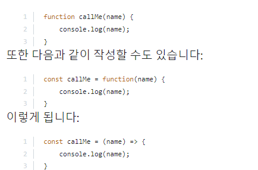

const는 상수

let은 덮어쓰기 가능

하지만 const에 객체가 저장되어있을 경우 그 값이 아니라 그 값이 저장된 메모리 주소가 

변수에 할당되므로 .push등을 사용해서 객체를 바꿀 수 있다.


=== 은 앞 뒤에 오는 값이 동일한 지 boolean 을 return한다.


함수의 매개변수에 (parameter = 어쩌구)식으로 기본값을 설정할 수 있다.

함수에서 return을 할 경우 return 값을 변수에 할당할 것.


() => {}

()는 매개변수가 1개일 때만 생략 가능하다

{} 반환문 외 로직이 없으면 return, 중괄호 생략 가능하다.

만약 객체만 반환할 경우 추가 괄호로 감싸야 한다.


객체에는 함수를 저장할 수 있는데 이를 메소드라고 부른다.


```javascript
const user = {
    age: 34,
greet() {
    console.log("Hello");
    console.log(this.age);
}
};


user.greet()
```

  class 정의 후 사용하기

```javascript
class User {
    constructor(name,age) {
    this.name=name;
    this.age=age;
}
}


const user1 = new User("subin", 19);
```


디스트럭쳐링


- 배열

```javascript
const [name, age] = [A, 30]
```

- 객체

```javascript
const {name : username, age} = {
    name: "Max",
    age: 20
}
```

    객체에서는 객체 key값과 똑같은 값을 중괄호 안에 써야하나. : alias 식으로 별명을 붙일 수 있다.


- 매개변수 객체

```javascript
function storeOrder({id, currency}){
    localstorage.setItem('id', id);
    localstorage.setItem('currency', currency);
}


function storeOrder(order){
    localstorage.setItem('id', order.id);
    localstorage.setItem('currency', order.currency);
}

```


